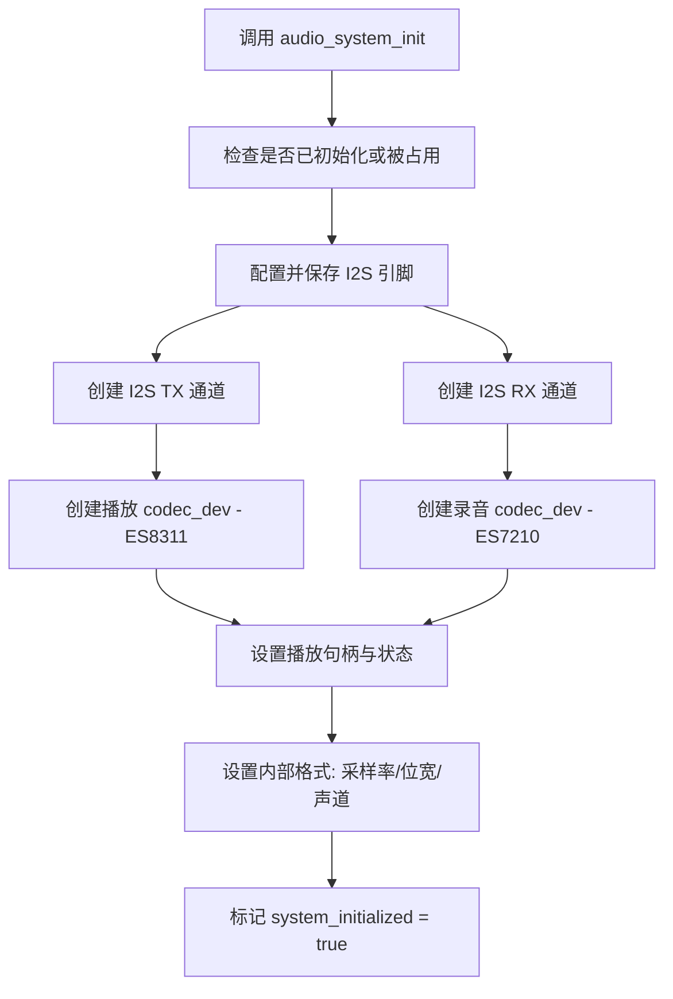
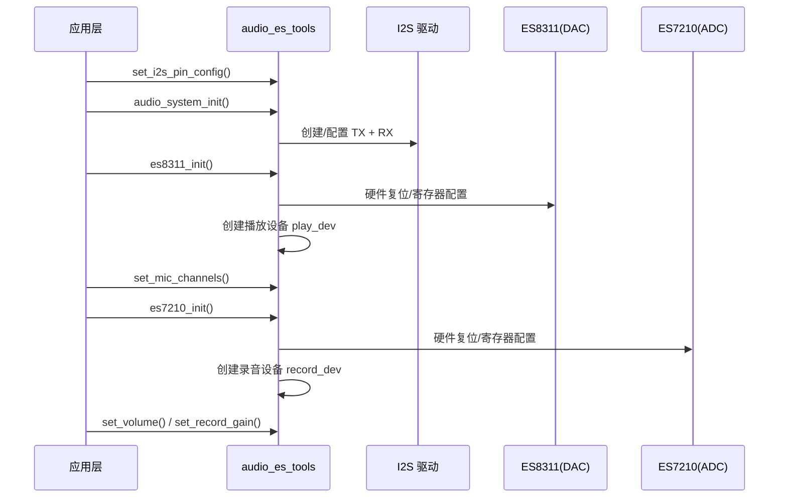
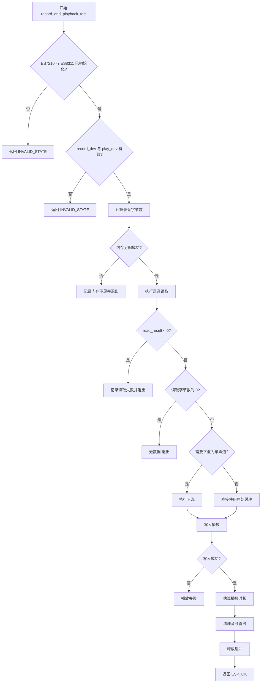
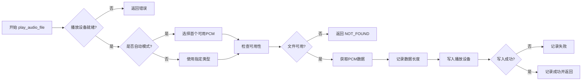
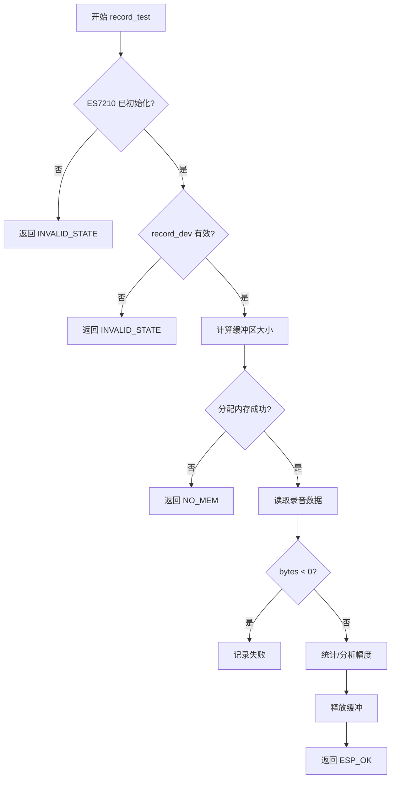
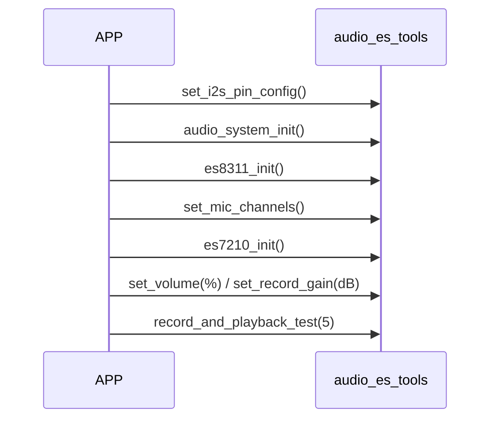

# audio_es_tools 主要流程概览

> 本文档总结 `audio_es_tools.cpp` 中核心功能的调用/状态流程，便于阅读与维护。使用 Mermaid 绘制流程图（VSCode 安装 Mermaid 预览插件可直接查看）。

## 1. 音频系统初始化整体流程

## 2. ES8311 / ES7210 初始化（典型顺序）

## 3. record_and_playback_test(record_duration_seconds)

### 关键点说明

- read 返回值是“实际读取字节数”或“负数错误码”；必须与旧逻辑区分。
- 下混：当录音声道数 > 播放声道（常见：多麦录音 -> 单声道播放）时，对所有声道求平均或取首通道。
- 估算播放时长：`play_time_ms = play_size * 1000 / (sample_rate * 播放声道 * bytes_per_sample)`，用于 `vTaskDelay()` 等待数据真正输出完毕。
- `clear_audio_pipeline(timeout_ms)`：用于清除底层剩余缓冲，避免“听起来像播放两次”或尾部残留。

## 4. play_audio_file(audio_file_type)

## 5. record_test(record_duration_ms)

## 6. 典型调用顺序（应用侧）

## 7. 可能的“录一次听两次”现象排查提示

| 可能原因                         | 排查方向                                   | 解决建议                           |
| -------------------------------- | ------------------------------------------ | ---------------------------------- |
| 播放等待时间估算不足             | 日志对比实际时间                           | 增加尾部延时或查询底层缓冲状态     |
| 未清空底层 I2S / codec FIFO      | `clear_audio_pipeline` 返回值            | 在播放前后都调用一次清理           |
| 录放使用同一物理总线且有硬件回环 | 硬件原理图/codec 配置寄存器                | 关闭回采(loopback)或静音功放再录音 |
| 多声道 -> 单声道下混逻辑错误     | 下混后字节数 vs 估算时间                   | 使用 frames 计算校验               |
| 播放调用两份不同版本文件         | 工程里存在 otool_audio / otools_audio 两份 | 删除旧目录或统一引用路径           |

## 8. 后续可改进点

- 增加“播放完成”回调而非估算时间 + delay
- 使用环形缓冲 + 分段录放（降低一次性大 malloc）
- 通过 `esp_codec_dev_*` 查询底层 FIFO 状态（若驱动支持）
- 抽象通道/位宽自适应工具函数

---

如需再生成状态机版本或导出 PNG，可继续说明。
